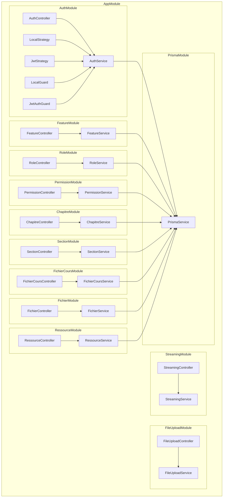

## Architecture Diagram

To render this diagram (Mermaid Syntax), you can:
* Install the [Markdown Preview Mermaid Support](https://marketplace.visualstudio.com/items?itemName=bierner.markdown-mermaid) extension in VS Code, or
* Use the links below to open it in Mermaid Live Editor.

For any issues or feature requests, please visit our [GitHub repository](https://github.com/swark-io/swark) or email us at contact@swark.io.

## Generated Content
**Model**: GPT 4o  
**Mermaid Live Editor**: [View](https://mermaid.live/view#pako:eNqNlsFugzAQRH8l8jn5AQ6VokSpVLVS1bQ3Li5sgiWDkbFbRVH-vQZDwOy6JLfMTMZbvDz1yjKVA0tYWp01r4vV5z6tVu7T2G8vbOv6TeVWgtfbz9aaYq69a9GUfK4egBurYS5_KIm0d9ClaBqhqrmzK3gtDG45QmaI-EFkhQC9U1Y3EQ_NA03j4hngvISvWiqeo8PdQLwU1XlqQJWn1fz5EQ-r1XaqMlpJCTrUj6B_RDYJv6qMS3ccN3C-jPLLr8Fil322XOdBsO2dqNSYkZvqZWrY3grmpZqpy241qrPVFwvjmzI6VPnoLh4RW7lBp-oHb7E8sre9TFX31mLzA6vfeeR1TvxHD4qeEa1f3pbYq3g3yL0ZzAcmj73Ro0PPP7jL90uhIWAGeceDubz_JGq9GvtxSJzVZvOEYTMRugDRGLCIbplwiQ6MjIoW3HmFEz6DsNQFKSKFGvV3-VxIpC6HYDQR4kUUg3yaxg-S49WYPl2WBM9MjJci7HRRijihFm-kSeNvKAYZwnjgAKqbql2-fQwXvwIkV-bqf5NipvTDIpz0Dxkzwl8IwgNbs9LtDhe5-_ftmjJTQAkpS1Ypy-HErTQpu7mQrXP3Nu4Fd_QoWWK0hTXj1qjjpcqG71rZc8GSE5cN3P4AcytbrA) | [Edit](https://mermaid.live/edit#pako:eNqNlsFugzAQRH8l8jn5AQ6VokSpVLVS1bQ3Li5sgiWDkbFbRVH-vQZDwOy6JLfMTMZbvDz1yjKVA0tYWp01r4vV5z6tVu7T2G8vbOv6TeVWgtfbz9aaYq69a9GUfK4egBurYS5_KIm0d9ClaBqhqrmzK3gtDG45QmaI-EFkhQC9U1Y3EQ_NA03j4hngvISvWiqeo8PdQLwU1XlqQJWn1fz5EQ-r1XaqMlpJCTrUj6B_RDYJv6qMS3ccN3C-jPLLr8Fil322XOdBsO2dqNSYkZvqZWrY3grmpZqpy241qrPVFwvjmzI6VPnoLh4RW7lBp-oHb7E8sre9TFX31mLzA6vfeeR1TvxHD4qeEa1f3pbYq3g3yL0ZzAcmj73Ro0PPP7jL90uhIWAGeceDubz_JGq9GvtxSJzVZvOEYTMRugDRGLCIbplwiQ6MjIoW3HmFEz6DsNQFKSKFGvV3-VxIpC6HYDQR4kUUg3yaxg-S49WYPl2WBM9MjJci7HRRijihFm-kSeNvKAYZwnjgAKqbql2-fQwXvwIkV-bqf5NipvTDIpz0Dxkzwl8IwgNbs9LtDhe5-_ftmjJTQAkpS1Ypy-HErTQpu7mQrXP3Nu4Fd_QoWWK0hTXj1qjjpcqG71rZc8GSE5cN3P4AcytbrA)

