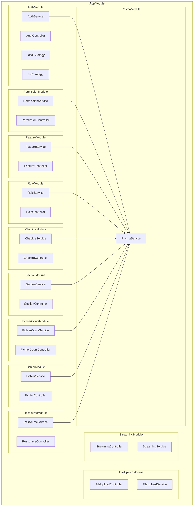

## Architecture Diagram

To render this diagram (Mermaid Syntax), you can:
* Install the [Markdown Preview Mermaid Support](https://marketplace.visualstudio.com/items?itemName=bierner.markdown-mermaid) extension in VS Code, or
* Use the links below to open it in Mermaid Live Editor.

For any issues or feature requests, please visit our [GitHub repository](https://github.com/swark-io/swark) or email us at contact@swark.io.

## Generated Content
**Model**: GPT 4o  
**Mermaid Live Editor**: [View](https://mermaid.live/view#pako:eNqNVctugzAQ_JXI5-YHOFSKEuVQtVJU2hsXFzZgydjIj1ZRlH-vKaGA2ZXjGzPD7LIPc2WlroBlrFC14V2z-TgUahOO9V8DsOu6N115CQPen513TYydjLAtj9EjcOcNxPC7livsBKYV1gqtYmbf8E64tYuF0iHyoygbAWavvbEEt8oHrA3yEtZ6CZ-d1LyKmTwkxFuh6jkBqipUXD-kWD2218oZLSWYJZ6D-RblTPyqSy5DOO6gvkzwy49bglhwuqgTgyUysYt0sBBEi-8wZn6nks7YlPQY5tnjSUNqkEYcMx65pDkxjfkAY9Z3Kl3h9ED_cWitZ_yjgcgYpH26ldSC_RNoU0fygcypPZ0YPP-RTYZAF35xE6A9HsmkP36BDij18uy-2Gy3z5h6tcmUcLmVlGq2Z5Qk2hhKtpx-Mqv1_CakqQ-IZgrTsSfWhrJxUYUf47VgroEWCpZtClbBmXvpCnYLIt9V4f49CB462LLMGQ9PjHun84sqx2ejfd2w7Mylhdsv57dxjg) | [Edit](https://mermaid.live/edit#pako:eNqNVctugzAQ_JXI5-YHOFSKEuVQtVJU2hsXFzZgydjIj1ZRlH-vKaGA2ZXjGzPD7LIPc2WlroBlrFC14V2z-TgUahOO9V8DsOu6N115CQPen513TYydjLAtj9EjcOcNxPC7livsBKYV1gqtYmbf8E64tYuF0iHyoygbAWavvbEEt8oHrA3yEtZ6CZ-d1LyKmTwkxFuh6jkBqipUXD-kWD2218oZLSWYJZ6D-RblTPyqSy5DOO6gvkzwy49bglhwuqgTgyUysYt0sBBEi-8wZn6nks7YlPQY5tnjSUNqkEYcMx65pDkxjfkAY9Z3Kl3h9ED_cWitZ_yjgcgYpH26ldSC_RNoU0fygcypPZ0YPP-RTYZAF35xE6A9HsmkP36BDij18uy-2Gy3z5h6tcmUcLmVlGq2Z5Qk2hhKtpx-Mqv1_CakqQ-IZgrTsSfWhrJxUYUf47VgroEWCpZtClbBmXvpCnYLIt9V4f49CB462LLMGQ9PjHun84sqx2ejfd2w7Mylhdsv57dxjg)

